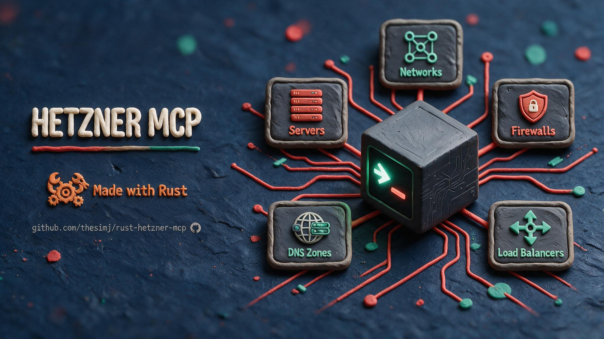

# hetzner-mcp

<p align="center">
  
</p>

[](https://crates.io/crates/hetzner-mcp)
[](https://github.com/thesimj/rust-hetzner-mcp/blob/main/LICENSE)
[](https://github.com/thesimj/rust-hetzner-mcp/blob/main/Cargo.toml)

An MCP (stdio) server for the [Hetzner Cloud API](https://docs.hetzner.cloud/),
in a single Rust binary: 93 tools covering every resource group of
`api.hetzner.cloud/v1`, from listing servers to managing DNS RRSets.

## Features

- **Full API coverage** - every resource group on `api.hetzner.cloud/v1`:
  servers, images, server types, SSH keys, locations, datacenters, volumes,
  networks, firewalls, Floating IPs, Primary IPs, Load Balancers, certificates,
  ISOs, placement groups, DNS zones and RRSets, action polling, and pricing.
- **Multiple projects** - one config file lists any number of projects with a
  name, token and optional description; every tool takes a `project` argument
  and `list_projects` shows names, descriptions and a fingerprint. See
  [Multiple projects](#multiple-projects).
- **Safety-annotated tools** - every tool declares `readOnlyHint` and
  `destructiveHint` on the wire; billable creates and permanent deletes say so
  in their descriptions, so MCP clients can gate confirmations correctly.
- **Latest MCP revision** - speaks protocol `2026-07-28` (with automatic
  negotiation down to older client revisions), pinned by tests.
- **Guarded inputs** - action names are allowlisted against the official API
  spec (all 11 allowlists match the spec exactly, in order), path segments are validated before any URL is built, and an update
  call with no fields set is rejected locally instead of sent.
- **Local-only, zero state** - stdio transport, TLS via
  [rustls](https://github.com/rustls/rustls), no telemetry, no files
  written, nothing persisted. Credentials come from one config file you own
  (`~/.config/hetzner-mcp/config.toml`). See [Privacy Policy](#privacy-policy).

## Install

```sh
cargo install hetzner-mcp
```

Build from source:

```sh
git clone https://github.com/thesimj/rust-hetzner-mcp
cd rust-hetzner-mcp
cargo install --path .
```

## Configure for Claude Code

1. Create the config file with at least one project (full syntax under
   [Configuration](#configuration)):

   ```sh
   mkdir -p ~/.config/hetzner-mcp
   $EDITOR ~/.config/hetzner-mcp/config.toml
   chmod 600 ~/.config/hetzner-mcp/config.toml
   ```

   ```toml
   [[projects]]
   name = "main"
   token = "<64-char token>"
   ```

2. Register the server - no token goes into the client config:

   ```sh
   claude mcp add hetzner -- hetzner-mcp
   ```

For any other MCP client, add it to your server config:

```json
{
  "mcpServers": {
    "hetzner": {
      "command": "hetzner-mcp"
    }
  }
}
```

## Configure for Claude Desktop

Each [release](https://github.com/thesimj/rust-hetzner-mcp/releases) attaches a
Claude Desktop extension bundle (`hetzner-mcp-macos.mcpb`,
`hetzner-mcp-linux.mcpb`, `hetzner-mcp-windows.mcpb`). Create
`config.toml` first (see [Configuration](#configuration)), open the bundle in
Claude Desktop, and point the extension's *config file* setting at it (the
default is `~/.config/hetzner-mcp/config.toml`). If the file picker does not
show the hidden `.config` folder, press `Cmd+Shift+.` on macOS, enable *Show
hidden items* on Windows, or paste the path.

If the extension shows *Server disconnected*, the startup error (missing file,
bad token length, ...) is in Claude Desktop > Settings > Developer > *Open Logs
Folder* (`mcp-server-hetzner-mcp.log`).

## Connect another client (CLI, IDE, agent)

`hetzner-mcp` is a universal local stdio MCP server. **[CONNECT.md](CONNECT.md)**
has copy-paste setup for Claude Code, Codex CLI, Gemini CLI, Antigravity,
Cursor, Windsurf, VS Code (Copilot), Zed, Cline, Roo Code, Continue, Goose,
opencode, Crush, Amp, and OpenHands.

## Configuration

`hetzner-mcp` reads exactly one file at startup and nothing else - no
environment variables, no `.env`. It never writes the file and never copies
tokens anywhere else.

### Where the file lives

| Platform | Default path |
| --- | --- |
| Linux, macOS | `$XDG_CONFIG_HOME/hetzner-mcp/config.toml` if `XDG_CONFIG_HOME` is set and non-empty, else `~/.config/hetzner-mcp/config.toml` |
| Windows | `%USERPROFILE%\.config\hetzner-mcp\config.toml` |
| Any | `hetzner-mcp --config /path/to/config.toml` overrides the lookup |

Use an absolute path with `--config` - MCP clients start the server from an
arbitrary working directory. Every startup error prints the resolved absolute
path it tried, and `hetzner-mcp --help` prints the default path for your
machine. A missing file is reported with a minimal example and the `--config`
hint; a file that is not UTF-8 (a common Windows editor default) is rejected
with a hint to re-save it as UTF-8.

### Example

```toml
# ~/.config/hetzner-mcp/config.toml
# ($XDG_CONFIG_HOME/hetzner-mcp/config.toml if XDG_CONFIG_HOME is set;
#  %USERPROFILE%\.config\hetzner-mcp\config.toml on Windows;
#  or any path via: hetzner-mcp --config /path/to/config.toml)
#
# Keep this file private - it holds API tokens:  chmod 600 ~/.config/hetzner-mcp/config.toml
# Top-level keys (`default`, `endpoint`) must come BEFORE the first [[projects]] table.
# Each project is a [[projects]] table - double brackets, one table per project.

# Optional. With several projects, read-only tools may omit `project` and use this one.
# Mutating tools (create_*/update_*/delete_*/*_action/power_server) always require `project`.
default = "nb-main"

# Optional. API base URL for every project. https://, or http:// to 127.0.0.1/[::1]/localhost only.
# endpoint = "https://api.hetzner.cloud/v1"

[[projects]]
name = "nb-main"                 # [a-z0-9._-]{1,64}, unique
token = "0000000000000000000000000000000000000000000000000000000000000000"   # exactly 64 characters, unique
description = "main infra: web servers, load balancer, volumes"   # optional, <= 200 chars; shown to the model - keep it short

[[projects]]
name = "nb-dns"
token = "1111111111111111111111111111111111111111111111111111111111111111"
description = "DNS zones only (read-only token)"

[[projects]]
name = "lab"
token = "2222222222222222222222222222222222222222222222222222222222222222"
# description is optional - the name alone is listed when it is absent
```

### Keys

| Key | Required | Default | Rules |
| --- | --- | --- | --- |
| `default` | no | - | Name of one `[[projects]]` entry. With several projects, read-only tools may omit `project` and use it; mutating tools always require `project` explicitly. Allowed with a single project too. |
| `endpoint` | no | `https://api.hetzner.cloud/v1` | API base URL for every project. Must be `https://`, or `http://` to `127.0.0.1`, `[::1]` or `localhost` (a local mock). A trailing `/` is trimmed; `""` means the default. |
| `projects[].name` | yes | - | Matches `[a-z0-9._-]{1,64}`; unique. This is the value the model passes as `project`. |
| `projects[].token` | yes | - | Hetzner Cloud API token, exactly 64 characters (not trimmed - a stray space is reported as "got 65"); unique across projects. |
| `projects[].description` | no | - | Trimmed; at most 200 characters; empty means absent. Shown in every tool's `project` argument and in `list_projects` - keep it to a few words (e.g. `DNS zones`); the 200-char cap is a limit, not a target. |

Unknown keys are rejected. Two TOML gotchas, both caught with a targeted hint:

- Top-level keys (`default`, `endpoint`) must appear **above** the first
  `[[projects]]` table - below it, TOML makes them fields of that project.
- Projects are `[[projects]]` tables with **double** brackets, one table per
  project. `[projects]` with single brackets is a map, not a list.

### Startup checks

The server exits non-zero (the MCP client shows it as disconnected) and prints
`Error: invalid config file <absolute path>` plus a `Caused by:` line when:

- no `[[projects]]` entry is defined;
- a `name` does not match `[a-z0-9._-]{1,64}`, or is used twice;
- a `token` is not exactly 64 characters, or is identical to another
  project's token;
- a `description` exceeds 200 characters;
- `default` does not name a configured project (the configured names are
  listed);
- `endpoint` is not `https://` and not `http://` to a loopback address;
- the TOML has a syntax error, an unknown key, or a misplaced top-level key.

Every per-project message cites the entry by 1-based index and, once the name
has passed validation, by name - `projects[2] ("nb-dns"): token must be
exactly 64 characters (got 65)`. No message ever quotes a token, a rejected
name, or a line of the file, so stderr and client logs stay safe to share.

### Tokens

Create an API token in the Hetzner Cloud Console, per
[Hetzner's guide](https://docs.hetzner.com/cloud/api/getting-started/generating-api-token).
Tokens are per-project and come in two flavors - **read-only** covers every
`list_*`/`get_*` tool; pick **read & write** only if you need the mutating
tools. `config.toml` is the only place tokens live: keep it at mode `0600`
(`chmod 600 ~/.config/hetzner-mcp/config.toml`), never commit it to any
repository, and rotate a project by editing its `token` line and restarting the
client. The token is sent solely to the Hetzner
API as a bearer header; it is never logged or written anywhere.

## Multiple projects

List several `[[projects]]` tables and every pre-existing tool gains a
`project` argument: a string `enum` of the configured names, described as
"Which configured Hetzner project to act on - one of: lab, nb-dns (DNS zones
only (read-only token)), nb-main (main infra: ...). Call list_projects if
unsure." - the descriptions from `config.toml` are what lets the model pick
the right project. A successful result is wrapped as
`{"project": ..., "result": ...}`, while an error result instead gets a
prepended `project: <name>` text line. The top-level `default` key sets a
default project: read-only tools may then omit `project`, but mutating tools
always require it explicitly. With one project, nothing about the tools or
their output changes and calls may omit `project`.

Use `list_projects` to confirm names and catch a mislabeled token - it returns
each project's `name`, `description` (`null` when unset), `is_default`, and a
lazy `fingerprint` (server count and up to two server names, or
`unreachable: <error>`); it never returns a token.

`hetzner-mcp` no longer shares `HCLOUD_TOKEN` with the official `hcloud` CLI;
the two are configured independently.

## Migrating from 0.3.x

0.4.0 stops reading `HCLOUD_TOKEN`, `HCLOUD_PROJECT` and `HCLOUD_ENDPOINT`.
Create `~/.config/hetzner-mcp/config.toml` (`chmod 600`) and remove the `env`
block from your MCP client config:

| 0.3.x | 0.4.0 |
| --- | --- |
| `HCLOUD_TOKEN=<token>` | one `[[projects]]` entry; pick any name (the implicit name `default` is gone - e.g. `name = "main"`) |
| `HCLOUD_TOKEN=prod=<t>,staging=<t>` | one `[[projects]]` entry per pair |
| `HCLOUD_PROJECT=prod` | top-level `default = "prod"` |
| `HCLOUD_ENDPOINT=<url>` | top-level `endpoint = "<url>"` |

With a single project, calls may still omit `project`. Saved prompts that pass
`project = "default"` must use the new name.

## Tools

93 tools total, across 9 routers. Every `list_*`/`get_*` tool is read-only.
`*_action` tools take an allowlisted `action` name plus an optional `params`
object; the allowed actions are noted after each.

**Servers** (compute + servers_ops)
- `list_servers` - list servers, filterable by name, label selector, or status, with sort support
- `get_server` - get a server by ID
- `create_server` - create a server, optionally with public_net, networks, firewalls, volumes, placement_group, and automount. **Billable** (public_net's enable_ipv4 defaults to true and bills a Primary IPv4 unless disabled). Response includes `root_password` exactly once
- `delete_server` - delete a server and all its data. **Destructive**
- `power_server` - poweron/poweroff/reboot/shutdown a server. **Destructive** (interrupts workloads, except poweron)
- `update_server` - update a server's name and/or labels
- `get_server_metrics` - get CPU/disk/network metrics for a server over a time period
- `server_action` - run a server action. **Destructive.** Actions: add_to_placement_group, attach_iso, attach_to_network, change_alias_ips, change_dns_ptr, change_protection, change_type, create_image, detach_from_network, detach_iso, disable_backup, disable_rescue, enable_backup, enable_rescue, poweroff, poweron, reboot, rebuild, remove_from_placement_group, request_console, reset, reset_password, shutdown (23 total; poweron/poweroff/reboot/shutdown are also available via `power_server`)

**Images**
- `list_images` - list images, filterable by type, sort, status, bound_to, include_deprecated, architecture, name, or label selector
- `get_image` - get an image by ID
- `update_image` - update an image's description, type, or labels
- `delete_image` - delete an image (snapshot or backup) permanently. **Destructive**
- `image_action` - run an image action. Actions: change_protection (toggles delete protection)

**Server types**
- `list_server_types` - list available server types (plans)
- `get_server_type` - get a server type by ID

**SSH keys**
- `list_ssh_keys` - list SSH keys uploaded to the project, filterable by sort, name, fingerprint, or label selector
- `get_ssh_key` - get an SSH key by ID
- `create_ssh_key` - upload a new SSH key. Adds a persistent credential
- `delete_ssh_key` - delete an SSH key from the project. **Destructive**
- `update_ssh_key` - update an SSH key's name or labels

**Locations & datacenters**
- `list_locations` - list locations Hetzner resources can run in
- `get_location` - get a location by ID
- `list_datacenters` - list datacenters Hetzner resources can run in
- `get_datacenter` - get a datacenter by ID

**Volumes**
- `list_volumes` - list block storage volumes, filterable by name, label selector, sort, or status
- `get_volume` - get a volume by ID
- `create_volume` - create a volume. **Billable**
- `update_volume` - update a volume's name or labels
- `delete_volume` - delete a volume permanently (must be detached first). **Destructive**
- `volume_action` - run a volume action. **Destructive.** Actions: attach, detach, resize (grow-only, irreversible), change_protection

**Networks**
- `list_networks` - list private networks, filterable by name, label selector, or sort
- `get_network` - get a network by ID
- `create_network` - create a private network (free; billed resources attach to it)
- `update_network` - update a network's name, labels, or vSwitch route exposure
- `delete_network` - delete a network permanently. **Destructive**
- `network_action` - run a network action. **Destructive.** Actions: add_route, add_subnet, change_ip_range, change_protection, delete_route, delete_subnet

**Firewalls**
- `list_firewalls` - list firewalls, filterable by name, label selector, or sort
- `get_firewall` - get a firewall by ID
- `create_firewall` - create a firewall (free; billed servers it protects are not)
- `update_firewall` - update a firewall's name or labels
- `delete_firewall` - delete a firewall permanently. **Destructive**
- `firewall_action` - run a firewall action. **Destructive.** Actions: apply_to_resources, remove_from_resources, set_rules (replaces the entire rule set)

**Floating IPs**
- `list_floating_ips` - list Floating IPs, filterable by name, label selector, or sort order
- `get_floating_ip` - get a Floating IP by ID
- `create_floating_ip` - create a Floating IP. **Billable**
- `update_floating_ip` - update a Floating IP's description, labels, or name
- `delete_floating_ip` - delete a Floating IP permanently. **Destructive**
- `floating_ip_action` - run a Floating IP action. **Destructive.** Actions: assign, unassign, change_dns_ptr, change_protection

**Primary IPs**
- `list_primary_ips` - list Primary IPs, filterable by name, label selector, IP, or sort order
- `get_primary_ip` - get a Primary IP by ID
- `create_primary_ip` - create a Primary IP. **Billable**
- `update_primary_ip` - update a Primary IP's name, auto_delete flag, or labels
- `delete_primary_ip` - delete a Primary IP permanently. **Destructive**
- `primary_ip_action` - run a Primary IP action. **Destructive.** Actions: assign, unassign, change_dns_ptr, change_protection

**Load Balancers**
- `list_load_balancers` - list Load Balancers, filterable by name, label selector, or sort order
- `get_load_balancer` - get a Load Balancer by ID
- `create_load_balancer` - create a Load Balancer. **Billable**
- `update_load_balancer` - update a Load Balancer's name and/or labels
- `delete_load_balancer` - delete a Load Balancer permanently. **Destructive**
- `load_balancer_action` - run a Load Balancer action. **Destructive.** Actions: add_service, add_target, attach_to_network, change_algorithm, change_dns_ptr, change_protection, change_type, delete_service, detach_from_network, disable_public_interface, enable_public_interface, remove_target, update_service (13 total)
- `get_load_balancer_metrics` - get time-series metrics (open_connections, connections_per_second, requests_per_second, bandwidth) for a Load Balancer
- `list_load_balancer_types` - list available Load Balancer types, filterable by name
- `get_load_balancer_type` - get a Load Balancer type by ID

**Certificates**
- `list_certificates` - list TLS certificates, filterable by name, label selector, sort, or type
- `get_certificate` - get a certificate by ID
- `create_certificate` - upload a certificate, or request a managed Let's Encrypt certificate
- `update_certificate` - update a certificate's name or labels
- `delete_certificate` - delete a certificate permanently. **Destructive**
- `certificate_action` - run a certificate action. Actions: retry (retries issuance for a failed managed certificate)

**ISOs**
- `list_isos` - list ISOs available to attach to servers, filterable by name/architecture
- `get_iso` - get an ISO by ID

**Placement groups**
- `list_placement_groups` - list placement groups, filterable by name, label selector, sort, or type
- `get_placement_group` - get a placement group by ID
- `create_placement_group` - create a placement group
- `update_placement_group` - update a placement group's name or labels
- `delete_placement_group` - delete a placement group permanently. **Destructive**

**DNS zones & RRSets**
- `list_zones` - list DNS zones, filterable by name, label selector, sort, or mode
- `get_zone` - get a zone by ID or name
- `create_zone` - create a DNS zone
- `update_zone` - update a zone's labels
- `delete_zone` - delete a zone and all its RRSets permanently. **Destructive**
- `zone_action` - run a zone action. **Destructive.** Actions: change_primary_nameservers, change_protection, change_ttl, import_zonefile
- `get_zone_zonefile` - export a zone's zonefile in BIND format (the inverse is `zone_action`'s `import_zonefile`)
- `list_zone_rrsets` - list a zone's RRSets, filterable by name, type, or label selector
- `get_zone_rrset` - get a single RRSet by zone and name/type
- `create_zone_rrset` - create a new RRSet in a zone
- `update_zone_rrset` - update an RRSet's labels
- `delete_zone_rrset` - delete an RRSet from a zone permanently. **Destructive**
- `zone_rrset_action` - run an RRSet action. **Destructive.** Actions: change_protection, change_ttl, set_records, add_records, remove_records, update_records

**Global actions & pricing**
- `get_actions` - fetch one or more actions by ID (the API removed listing all actions; at least one ID is required)
- `get_action` - get a single action by ID; poll until status is success or error
- `get_pricing` - get current Hetzner Cloud pricing for all resource types

**Projects**
- `list_projects` - list every configured project by name and description, with `is_default` and a lazy fingerprint (server count and up to two server names, or `unreachable: <error>`). Never returns a token. See [Multiple projects](#multiple-projects)

## Coverage

Every resource group and every mutating action endpoint of
`api.hetzner.cloud/v1`: servers (full CRUD, metrics, the
23-action `server_action`, and `power_server`), images, server types, SSH
keys, locations, datacenters, volumes, networks, firewalls, Floating IPs,
Primary IPs, Load Balancers (+ types, metrics, the 13-action
`load_balancer_action`), certificates, ISOs, placement groups, DNS zones
(+ RRSets), global actions polling, and pricing.

The per-resource action-listing endpoints (`GET /<resource>/actions` and
friends) are not exposed as separate tools - poll actions with `get_actions`
/ `get_action` instead, which return the same action objects.

Storage Boxes are excluded: they live on a separate API
(`api.hetzner.com`), not `api.hetzner.cloud/v1`, so they are out of scope
for this server.

## Safety notes

- Every `list_*`/`get_*` tool is read-only and safe to call freely.
- Tools named `create_*`, `update_*`, `delete_*`, and `*_action` (including
  `power_server`) mutate real resources: creates may bill money, deletes are
  permanent, and actions can interrupt workloads - confirm with the user
  before calling any of them. The server never calls any of these on its own.
- Use read-only tokens where possible - Hetzner Cloud tokens can be created
  as read-only per project - and keep `config.toml` at mode `0600`: it is the
  only place tokens live.

## Verify the connection

```bash
echo '{"jsonrpc":"2.0","id":1,"method":"initialize","params":{"protocolVersion":"2026-07-28","capabilities":{},"clientInfo":{"name":"probe","version":"0"}}}' \
  | hetzner-mcp
```

A JSON line answering with `"name":"hetzner-mcp"` means stdio is healthy. To
test a config file that is not at the default path, append
`--config /path/to/config.toml`. A startup error (missing or invalid file)
arrives on stderr instead of the JSON line and names the exact path it tried.
More per-client verification tips: [CONNECT.md](CONNECT.md).

## Development

```bash
cargo fmt --check
cargo clippy --all-targets -- -D warnings
cargo test
```

The test suite (unit tests plus the `tests/` integration tests, including the
`--config` CLI tests that spawn the real binary against a temporary config
file) runs entirely against a local mock of the Hetzner API - no token, no
`~/.config/hetzner-mcp/config.toml`, and no network access to Hetzner are
needed to develop.

## Privacy Policy

`hetzner-mcp` runs entirely on your machine and collects no telemetry. The only
third party it contacts is Hetzner (`api.hetzner.cloud`), and only to fulfill
the requests you make. Your API token is sent solely to Hetzner to authenticate
those calls and is read once at startup from `~/.config/hetzner-mcp/config.toml`
(or the `--config` path); the server writes no files and persists nothing.
Full details: [PRIVACY.md](PRIVACY.md).

## License

Licensed under the Apache License, Version 2.0 ([LICENSE](LICENSE)).

Copyright (c) 2026 Nick Bubelich
